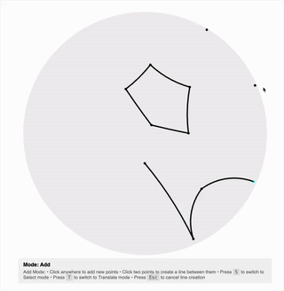

# poincaré disk / hyperbolic geometry playground


## what is this?
create, edit, translate geometries in hyperbolic geometry using the poincaré disk model

## why?
i wanted to explore hyperbolic space as part of a branding concept i was working on

## ai disclosure
this about 50% llm slop. i mainly just wrapped my head around the math and got the core rendering functionality to work. then i had claude add the editing mode logic and split everything into files.

## the math is probably wrong
please help me

## how to use?
```
git clone https://github.com/vimona3ds/poincare-disk-playground.git
cd poincare-disk-playground
pnpm install
pnpm start
```
